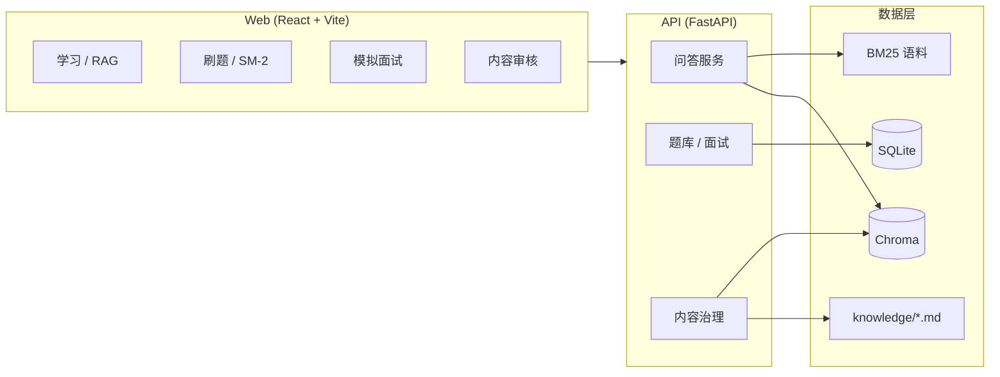

# Agent Knowledge Hub

**Agent 技术知识库 × 云厂商 SA 面试训练营** — 学习、刷题、模拟面试与可审核知识发布，一站完成。

面向 **OpenClaw / Hermes / Harness** 工程实践与 **阿里云、腾讯云、AWS** 售前架构面试备考。内置混合检索（向量 + BM25）、可追溯引用、间隔复习与内容治理流水线。

<p align="center">
  <a href="#功能概览">功能</a> ·
  <a href="#快速开始">快速开始</a> ·
  <a href="#架构">架构</a> ·
  <a href="#配置">配置</a> ·
  <a href="docs/ARCHITECTURE.md">技术文档</a>
</p>

---

## 功能概览

| 模块 | 说明 |
|------|------|
| **知识学习** | 混合 RAG 问答（Chroma + BM25），回答附带 `source_id` 引用片段 |
| **SA 刷题** | 结构化题库（架构 / 产品 / 行为 / 方案 / Agent），要点解析与 AI 阅卷 |
| **间隔复习** | SM-2 调度错题；进度页月历查看复习计划 |
| **模拟面试** | 自由多轮或结构化流程（自我介绍 → 项目 → 架构 → 产品 → 反问） |
| **面试报告** | 维度得分、亮点 / 缺口、改写建议、推荐 Lab；支持导出 PDF |
| **实操 Lab** | 8 个 2–8 小时动手实验（架构图、产品对比、部署等） |
| **内容治理** | Staging → 自动质检 → 人工审核 → 发布；增量向量索引与一键回滚 |
| **学习进度** | 作答统计、题库覆盖、Quiz / Mock 能力雷达 |

---

## 快速开始

### 环境要求

- Python 3.11+
- Node.js 18+
- （可选）OpenAI 兼容 API Key，用于完整 AI 阅卷与模拟面试官

### 1. 初始化语料

```bash
git clone https://github.com/HereisMichael/agent-knowledge-hub.git
cd agent-knowledge-hub
python scripts/seed_content.py
```

### 2. 启动后端

```bash
cd backend
python -m venv .venv
# Windows: .venv\Scripts\activate
# macOS/Linux: source .venv/bin/activate
pip install -r requirements.txt
cp .env.example .env   # 编辑 LLM_API_KEY、ADMIN_API_KEY
uvicorn app.main:app --reload --host 127.0.0.1 --port 8001
```

### 3. 启动前端

```bash
cd web
npm install
npm run dev
```

浏览器访问：**http://127.0.0.1:5174**  
API 文档：**http://127.0.0.1:8001/docs**

### Docker

```bash
docker compose up --build
```

服务端口：Web `5174` · API `8001`

---

## 架构



**内容发布流程**：`content/staging/` → 质检 → 管理端批准 → 写入 `knowledge/` → 增量索引（未发布内容不会进入向量库）。

更多 API、表结构与环境变量见 **[docs/ARCHITECTURE.md](docs/ARCHITECTURE.md)**。

---

## 配置

| 变量 | 说明 |
|------|------|
| `LLM_API_KEY` | OpenAI 兼容 API；留空则启用 Demo 模式（规则评分） |
| `ADMIN_API_KEY` | 内容审核接口请求头 `X-Admin-Key` |
| `KNOWLEDGE_PATH` | 已发布语料目录，默认 `../knowledge` |
| `INGEST_EXTRA_DIRS` | 额外只读语料目录（逗号分隔），变更将进入审核队列 |
| `AUTO_PUBLISH_TRUSTED` | 高置信内容自动发布（默认关闭） |
| `CONTENT_SCHEDULER_ENABLED` | 每日 06:00（Asia/Shanghai）扫描 staging |

完整列表见 `backend/.env.example`。

### 提交待审核内容

- 技术 / 面试 Markdown → `content/staging/tech/` 或 `content/staging/interview/`
- 题库增量 → `content/staging/questions.patch.jsonl`

---

## 仓库结构

```
agent-knowledge-hub/
├── knowledge/          # 已发布 RAG 语料与题库
├── content/            # 内容治理（feeds、staging）
├── backend/            # FastAPI 服务
├── web/                # React 前端
├── labs/               # 实操 Lab 定义
├── scripts/            # 语料种子与维护脚本
├── eval/               # 检索评测 golden set
└── docs/               # 架构与运维文档
```

---

## 检索评测

```bash
pip install -r backend/requirements.txt
python eval/run_eval.py
```

---

## 技术栈

| 层级 | 选型 |
|------|------|
| 后端 | Python 3.11, FastAPI, SQLite, Chroma, rank-bm25, APScheduler |
| 前端 | React 18, TypeScript, Vite |
| LLM | OpenAI 兼容 API（可配置 Base URL 与模型） |

---

## 参与贡献

欢迎提交 Issue 与 Pull Request。贡献题库、技术文档或 Lab 时，请遵循 staging → 审核流程，并确保 Markdown 含 `source_id` 与「参考来源」章节。

---

## License

[MIT](LICENSE)
